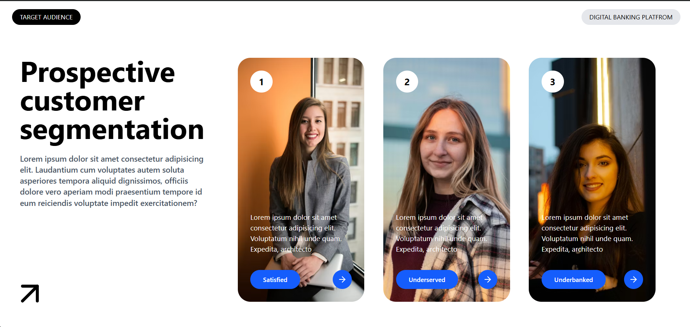

# 🎨 UI Project — React + Tailwind CSS

This project is a clean and modern **UI built using React and Tailwind CSS**.
It helped me understand React’s component structure, Tailwind’s utility-first styling, and how to build modular front-end interfaces.

## 🖼️ Project Screenshot

<div align="center">
  
</div>

## 🌟 What I Learned

### 🧩 React

* Creating and organizing multiple reusable components
* Understanding clean file/folder structures
* Importing and exporting components across sections
* Working effectively with JSX

### 🎨 Tailwind CSS

* Using utility classes for fast styling
* Spacing, colors, typography, and layout control
* Responsive UI techniques
* Styling without writing traditional CSS

This project strengthened my ability to style React components quickly and cleanly using Tailwind.

## 🛠️ Tech Stack

* ⚛️ **React (Vite)**
* 🎨 **Tailwind CSS**
* 🔗 **Lucide-React**
* 🟦 **JavaScript (JSX)**

## 📁 Project Structure

```
src/
 ├── components/
 │     ├── section1/
 │     │      ├── HeroText.jsx
 │     │      ├── Arrow.jsx
 │     │      └── LeftContent.jsx
 │     └── section2/
 │            └── ...
 ├── App.jsx
 ├── index.css
 └── main.jsx
```

This structure helped me understand how to keep UI components clean, modular, and scalable.

## ✨ Features

* Fully responsive UI
* Tailwind-based modern design
* Multiple reusable components
* Clean and organized code structure
* Icon usage with lucide-react

## 🚀 Installation & Setup

```sh
npm install
npm run dev
```

## 📌 Conclusion

Building this project helped me gain practical experience with:

* Tailwind’s styling workflow
* React’s component architecture
* Managing multiple files and sections
* Designing clean and structured UI layouts

It was a helpful project that improved my overall front-end development skills.


